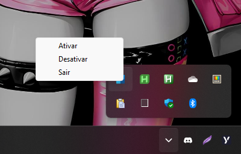

# FancyZones Dynamic Size

Este script permite ajustar dinamicamente o tamanho das zonas e janelas do FancyZones do PowerToys, mas apenas em um layout de 2 colunas. Na versão master, existe um ícone na bandeja para ativar, desativar ou fechar o script.



## Requisitos

- Python 3.x
- PowerToys com FancyZones habilitado

## Instalação

1. Clone este repositório ou baixe o arquivo `fancyZone.py`.
2. Instale as bibliotecas necessárias executando o seguinte comando:

    ```sh
    pip install keyboard pyautogui pystray pillow
    ```

## Configuração

1. Certifique-se de que você tem um layout de 2 zonas horizontais no FancyZones com o nome `dynamic`.
2. Defina o atalho para este layout como `Ctrl + Win + Alt + 1`. Se você preferir outro atalho, ajuste o script para refletir isso.

## Uso

1. Execute o script:

    ```sh
    python fancyZone.py
    ```

2. Use os seguintes atalhos para controlar as zonas:

    - `Alt + =` para aumentar a primeira zona em 5%.
    - `Alt + -` para diminuir a primeira zona em 5%.
    - `Alt + X` para inverter as zonas.

3. Para parar o script, pressione `Esc`.

## Nota

Este script foi projetado para funcionar apenas com layouts de 2 zonas horizontais. Certifique-se de que o layout tenha o nome `dynamic` e que o atalho esteja mapeado corretamente no script.

## Exemplo de Configuração do FancyZones

- Nome do layout: `dynamic`
- Atalho: `Ctrl + Win + Alt + 1`

Se você usar um nome ou atalho diferente, ajuste as variáveis `layout_file` e `fancyzones_icon_path` no script conforme necessário.

```python
layout_file = os.path.join(local_appdata, r"Microsoft\PowerToys\FancyZones\custom-layouts.json")
fancyzones_icon_path = os.path.join(local_appdata, r"PowerToys\RunPlugins\PowerToys\Images\FancyZones.png")